# ES20 P2 submission, Group NN

## Feature PPA

### Subgroup
 - Nome, istID, githubID
   + Issues assigned: [#1](https://github.com), [#3](https://github.com)
 - Nome, istID, githubID
   + Issues assigned: [#2](https://github.com), [#4](https://github.com)
 
### Pull requests associated with this feature

The list of pull requests associated with this feature is:

 - [PR #000](https://github.com)
 - [PR #001](https://github.com)
 - [PR #002](https://github.com)

### Web services definition

#### Controllers
 - [Controller0](https://github.com)
 - [Controller1](https://github.com)

### Feature testing

Each subgroup member defined one reading test and one writing test. The direct links to these are:

 - [ReadingTestJMeter](https://github.com)
 - [WritingTestJMeter](https://github.com)

#### Screenshots of Results Trees and DB cleanup

### Load testing

Each subgroup member defined one reading test and one writing test. The direct links to these are:

 - [ReadingTestJMeter](https://github.com)
 - [WritingTestJMeter](https://github.com)

#### Screenshots of Summary Reports and DB cleanup

### Service profiling

We used the [Async Profiler](https://www.jetbrains.com/help/idea/async-profiler.html).

#### Screenshots of summary reports

#### Discussion of findings

**TODO**: include here a short description of findings (max. 3 sentences). If
you found opportunities for optimization, you can use more than 3 sentences to
describe what you found and how you optimized your code.

---

## Feature DDP

### Subgroup
 - Daniel Gonçalves, ist191004, masterzeus05
   + Issues assigned: [#68](https://github.com/tecnico-softeng/es20al_10-project/issues/68), [#71](https://github.com/tecnico-softeng/es20al_10-project/issues/71), [#74](https://github.com/tecnico-softeng/es20al_10-project/issues/74), [#76](https://github.com/tecnico-softeng/es20al_10-project/issues/76), [#77](https://github.com/tecnico-softeng/es20al_10-project/issues/77), [#78](https://github.com/tecnico-softeng/es20al_10-project/issues/78), [#79](https://github.com/tecnico-softeng/es20al_10-project/issues/79)
 - Gabriel Almeida, ist189446, galmeida9
   + Issues assigned: [#58](https://github.com/tecnico-softeng/es20al_10-project/issues/58), [#61](https://github.com/tecnico-softeng/es20al_10-project/issues/61), [#76](https://github.com/tecnico-softeng/es20al_10-project/issues/76), [#77](https://github.com/tecnico-softeng/es20al_10-project/issues/77), [#78](https://github.com/tecnico-softeng/es20al_10-project/issues/78), [#79](https://github.com/tecnico-softeng/es20al_10-project/issues/79)
 
### Pull requests associated with this feature

The list of pull requests associated with this feature is:

 - [PR #000](https://github.com)

### Web services definition

#### Controllers
 - [ClarificationController](https://github.com)
 - [ClarificationAnswerController](https://github.com)

### Create Clarification Feature testing

 - [WSGetClarificationUserTest](https://github.com)
 - [WSGetClarificationQuestionTest](https://github.com)
 - [WSGetClarificationCourseTest](https://github.com)
 - [WSCreateClarificationTest](https://github.com)

#### Screenshots of Results Trees and DB cleanup

##### WSGetClarificationUserTest

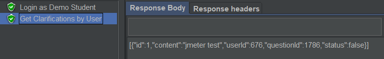

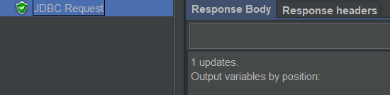

##### WSGetClarificationQuestionTest

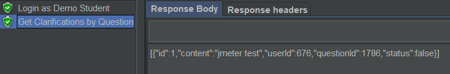
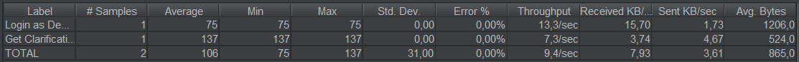
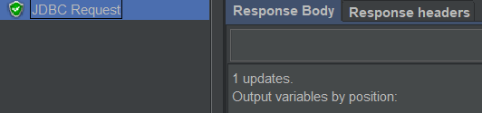

##### WSGetClarificationCourseTest

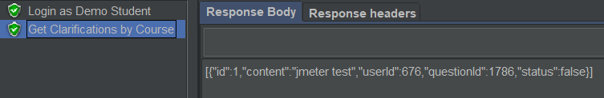
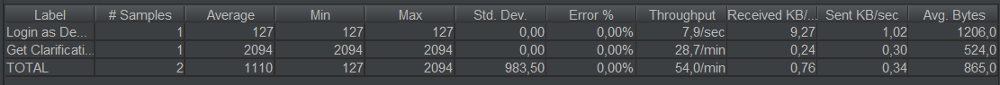
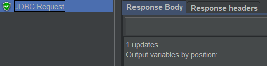

##### WSCreateClarificationTest

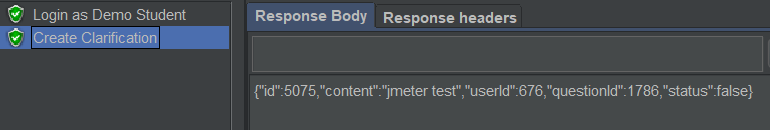
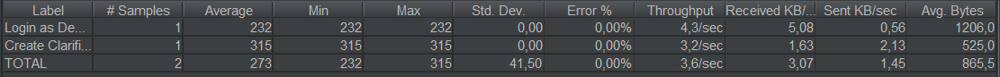
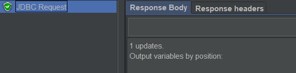

### Create Clarification Answer Feature testing

 - [ReadingTestJMeter](https://github.com)
 - [WritingTestJMeter](https://github.com)

#### Screenshots of Results Trees and DB cleanup

### Create Clarification Answer Load testing

 - [ReadingTestJMeter](https://github.com)
 - [WritingTestJMeter](https://github.com)

#### Screenshots of Summary Reports and DB cleanup

### Create Clarification Load testing

 - [WSGetClarificationUserLoadTest](https://github.com)
 - [WSGetClarificationQuestionLoadTest](https://github.com)
 - [WSGetClarificationCourseLoadTest](https://github.com)
 - [WSCreateClarificationLoadTest](https://github.com)

#### Screenshots of Summary Reports and DB cleanup

##### WSGetClarificationUserLoadTest

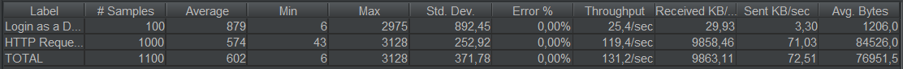

##### WSGetClarificationQuestionLoadTest

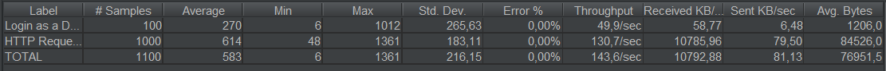

##### WSGetClarificationCourseLoadTest

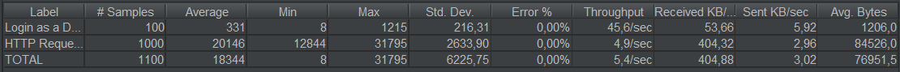
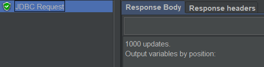

##### WSCreateClarificationLoadTest

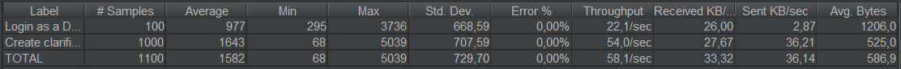
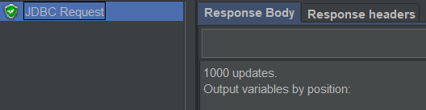

### Clarification Service profiling

We used the [Async Profiler](https://www.jetbrains.com/help/idea/async-profiler.html).

#### Screenshots of summary reports

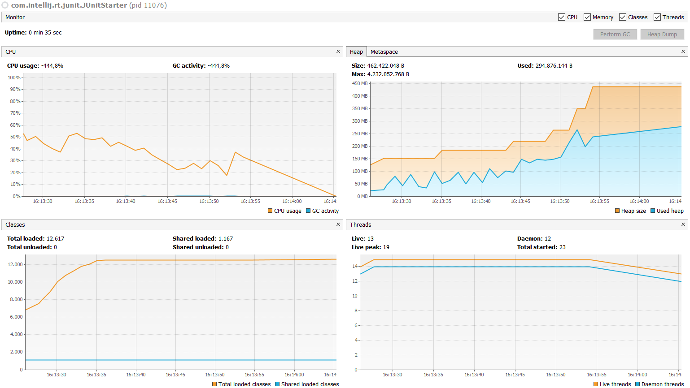
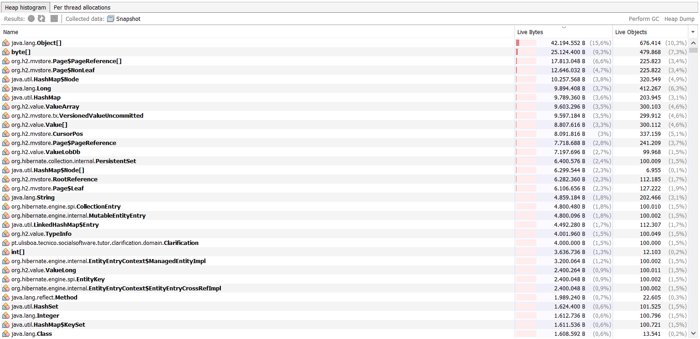

### Clarification Answer Service profiling

We used the [Async Profiler](https://www.jetbrains.com/help/idea/async-profiler.html).

#### Screenshots of summary reports

### Get Clarification profiling

We used the [Async Profiler](https://www.jetbrains.com/help/idea/async-profiler.html).

#### Screenshots of summary reports

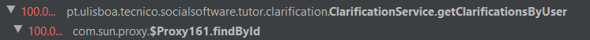

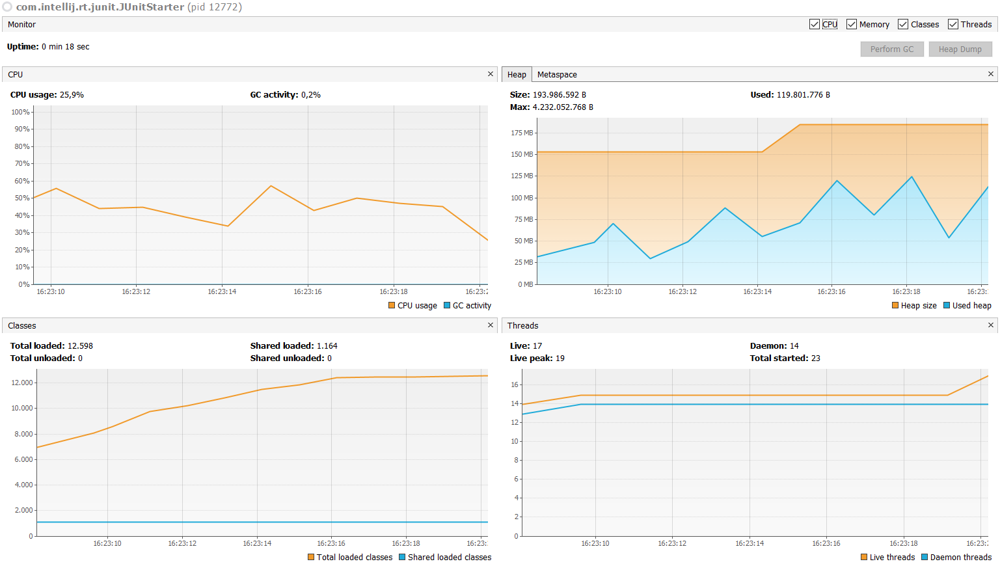
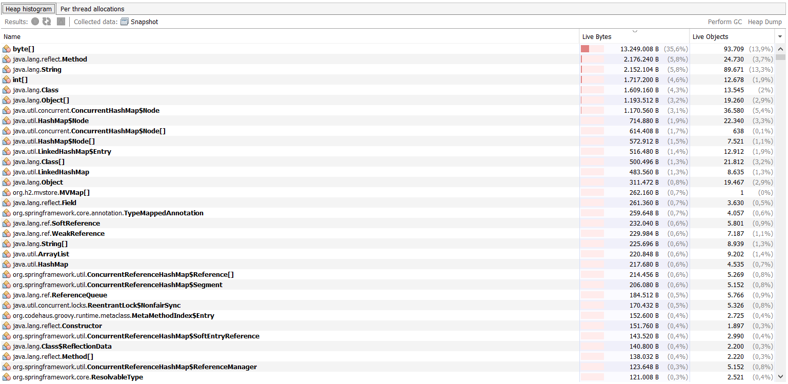

### Get Clarification Answer profiling

We used the [Async Profiler](https://www.jetbrains.com/help/idea/async-profiler.html).

#### Screenshots of summary reports

#### Discussion of findings

**TODO**: include here a short description of findings (max. 3 sentences). If
you found opportunities for optimization, you can use more than 3 sentences to
describe what you found and how you optimized your code.

---

## Feature TDP

### Subgroup
 - Nome, istID, githubID
   + Issues assigned: [#1](https://github.com), [#3](https://github.com)
 - Nome, istID, githubID
   + Issues assigned: [#2](https://github.com), [#4](https://github.com)
 
### Pull requests associated with this feature

The list of pull requests associated with this feature is:

 - [PR #000](https://github.com)
 - [PR #001](https://github.com)
 - [PR #002](https://github.com)

### Web services definition

#### Controllers
 - [Controller0](https://github.com)
 - [Controller1](https://github.com)

### Feature testing

Each subgroup member defined one reading test and one writing test. The direct links to these are:

 - [ReadingTestJMeter](https://github.com)
 - [WritingTestJMeter](https://github.com)

#### Screenshots of Results Trees and DB cleanup

### Load testing

Each subgroup member defined one reading test and one writing test. The direct links to these are:

 - [ReadingTestJMeter](https://github.com)
 - [WritingTestJMeter](https://github.com)

#### Screenshots of Summary Reports and DB cleanup

### Service profiling

We used the [Async Profiler](https://www.jetbrains.com/help/idea/async-profiler.html).

#### Screenshots of summary reports

#### Discussion of findings

**TODO**: include here a short description of findings (max. 3 sentences). If
you found opportunities for optimization, you can use more than 3 sentences to
describe what you found and how you optimized your code.

